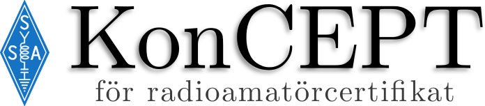

-   [LADDA NER OCH BYGG PROJEKTET](#ladda-ner-och-bygg-projektet)
-   [BIDRA TILL PROJEKTET](#bidra-till-projektet)
-   [OM SSA AKADEMIN](#om-ssa-akademin)
-   [KONTAKT](#kontakt)

**KonCEPT för Radioamatörcertifikat** är en bok
ursprungligen skriven av Lennart Wiberg och utgiven av 
[Sveriges Sändareamatörer](http://ssa.se) (SSA) i syfte att utbilda nya
radioamatörer. Den första upplagan är skriven 1997 och behöver
därför en uppdatering och tryckas i en ny upplaga. Detta projekt,
SSA Akademin, är bland annat till för digitalisering och uppdatering
av KonCEPT som kommer att leda till den andra upplagan av boken.

> :warning: **Observera:** Boken och materialet som finns att läsa här
är ett arbetsmaterial och ska inte användas som en färdig produkt
utan endast som ett underlag för arbetet med den.

LADDA NER OCH BYGG PROJEKTET
============================

Bygg projektet
--------------

Du kan ladda ner projektet och bygga den senaste versionen av PDF:en
själv. Instruktioner finns i filen [`BUILD.md`](BUILD.md).

PDF
---

Du kan ladda hem en hyfsat sen version av arbetet. Denna är dock inte
uppdaterad kontinuerligt så datumet visar hur pass ny den är.

**Hämta hem utkast version 2017-03-18:**
**[koncept.pdf](https://drive.google.com/open?id=0B7Mlo8g4g-UBZkhQUUxZNEpzSW8)**

BIDRA TILL PROJEKTET
====================

Det finns många olika sätt att bidra till projektet även fast man
inte vet hur man använder *Git* eller skriver *LaTeX*.

**Q: Jag kan koda och vill bidra; vad gör jag?**  
A: Börja med att läsa igenom filen [`texifiering.txt`](texifiering.txt)
noggrant och följa alla instruktioner där för hur koden till boken
är uppbyggd. Till exempel skrivs kommentarer i texten så här:

    Kommentarer vi har som del av den editoriella bearbetningen lägger vi
    synligt i texten med följande format:

    \hilight{TODO: Här ser det lite fel ut.}

    Det är behändigt att kunna söka på TODO:, och \hilight{} ger en
    gul markör i texten så vi vet när vi läser att här är något vi skall
    åtgärda.

Om du hittar något så kan du lämna en *issue* där du beskriver vart
du har hittat ett problem och om du har någon föreslagen förändring
så kommer din anmärkning att hanteras.

**Q: Jag vet inte hur man redigerar kod**  
A: Det finns flera sätt att hjälpa till. Du kan läsa boken och ge
förslag på förbättringar och om du vet hur man gör så kan du lämna
en *issue* med en beskrivning av fel och om möjligt en föreslagen
förändring. Annars kan du använda dig av kontaktinformationen nedan
och skicka ett mejl till oss så hjälper vi dig att komma igång.

OM SSA AKADEMIN
===============

Arbetet med denna bok är en del i en större satsning på att
uppdatera gammalt material, digitalisera material men också bredda
utbildningsmetoderna till mer än bara litteratur. Vi kallar projektet
för SSA Akademin. Vi undersöker hur och på vilka sätt utbildningen
under SSA kan moderniseras. Med modernisering syftas här utnyttjandet av
både digital teknik och dess möjligheter samt metoder som tidigare ej
använts inom SSA. Vi tar fram konkreta förslag på hur moderniseringen
ska gå till väga och genom för dem.

Vårt mål är att

-   fler ska vilja ta utbildningen för att bli radioamatör
-   de som examineras ska göra bättre ifrån sig på provet
-   de som deltar i utbildningen ska känna att det är en bra utbildning

KONTAKT
=======

-   [**Jonas "SM5PHU" Hultin**](mailto:sm5phu@gmail.com)
-   [Magnus "SA0MAD" Danielsson](mailto:magnus@rubidium.se)
-   [Hans "SM0UTY" Insulander](mailto:hans.insulander@codium.se)
-   [Petter "SA2PKA" Karkea](mailto:petter@karkea.se)
-   [Peter "SA2BLV" Lundberg](mailto:pette.lundberg@gmail.com)

